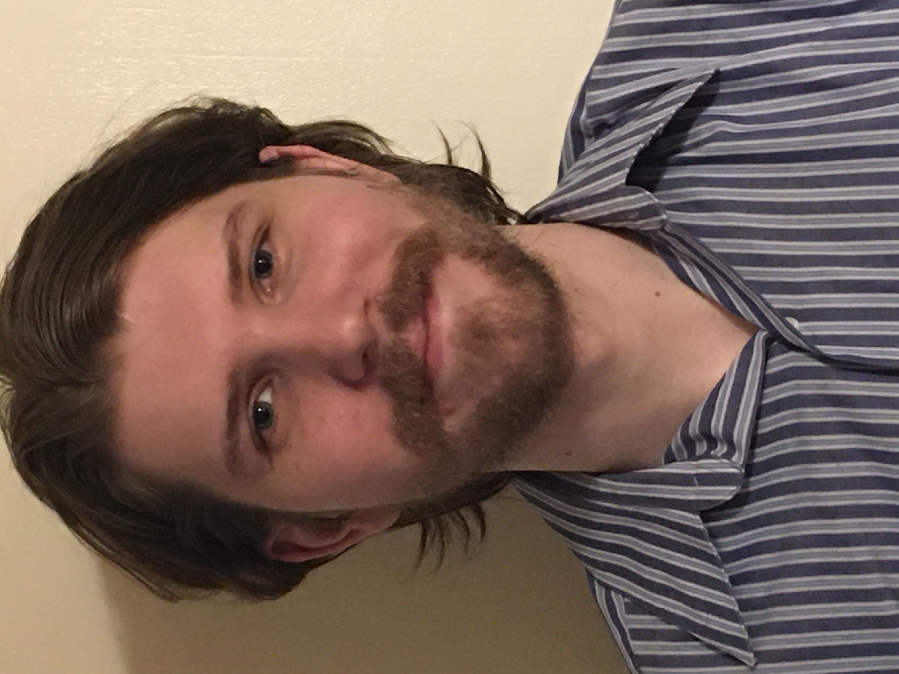

# ABOUT ME

Thank you for visiting my ePortfolio!

Computer Science has been something that I have always been interested in, my mom has worked for a software developer for twenty-eight years. From sitting on her lap while she would talk to her colleagues about their best approach to keeping companies under license to providing executives with feedback from the customer.  So, computers and software was something that I have been around from a young age I was one of the first kids in my neighbor to have my own computer because my mom didn’t want me to use her so she could work in peace. I remember my friends coming over to play the newest PC games as well as use our internet because again we were one of the first to not have dial up internet.

Currently, I am senior majoring in Computer Science with a concentration in Software Engineering at Southern New Hampshire University. I grew up in Aurora, Illinois and graduated from West Aurora High School in May 2010. After West Aurora, I proceeded to go to Waubonsee Community in the Fall of 2010 to pursue my associate degree in Mathematics. I was forced to take a step back from my degree to take care of my parents, but it allowed me the opportunity to think about my career and what I wanted to pursue, which brought me to realizing that computers were my true passion and were something that I wanted to pursue, so in fall 2014 I began retaking courses at a reduced rate at Waubonsee Community College to pursue my degree in Computer Science. In the Fall of 2018 I committed to that dream and enrolled at Southern New Hampshire University.

You can use the [editor on GitHub](https://github.com/mattlee2-snhu/CS499EPortfolio/edit/gh-pages/index.md) to maintain and preview the content for your website in Markdown files.

Whenever you commit to this repository, GitHub Pages will run [Jekyll](https://jekyllrb.com/) to rebuild the pages in your site, from the content in your Markdown files.

# CAREER GOALS AND OBJECTIVES

Firstly, for my career I want to complete my bachelor’s in Computer Science at Southern New Hampshire University. As well as any other certificates or education that will help improve my skills as an engineer. From there I want to use those skills and knowledge that I have learned and apply them at a company that I feel passionate about and can really get behind the product they are creating. I want to create something that makes a difference and helps people in their daily lives.

Now for my future goals, I want to be a Chief Technology Officer or Head of Engineering for top software engineering company. I also want to be the Head of a project that has an impact in peoples lives and is something that people use everyday. Financially my goal is to be able to support myself and my significant other as well as my parents if they need financial help

# ACADEMIC HISTORY

- ### Aug 2006-May 2010 - West Aurora High School

  - Completed courses with a focus in computers
  
  - Favorite subject: Mathematics

- ### Aug 2010-May 2018 - Waubonsee Community College

  - Started with a focus in mathematics
  
  - Transitioned into computer science in fall 2014

- ### Aug 2018-Present - Southern New Hampshire University

  - Concentration in software engineering
  
  - Developed security strategies to create error free code

# ACADEMIC AWARDS

### Feb 2018 - Certifacte from Workforce Development at Wabuonsee Community College for Python Developer Program(155-hour online program)

# Contact Me
mattr.lee18@gmail.com

(630) 404-2478
