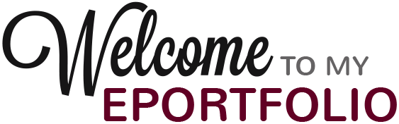
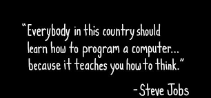

# ABOUT ME

Thank you for visiting my ePortfolio!

Computer Science has been something that I have always been interested in. Most of my mom’s career has been devoted to working for a software developer, at least for the past twenty-eight years. I can remember sitting on her lap while she would talk to her colleagues about various aspects of her job, such as the best approach for retaining customers, how to provide executives with customer feedback and supporting customers with licensing issues. Thus, I was introduced to computers and software at an early stage in my learning development, which created a good foundation for a career in Computer Science.

Currently, I am senior majoring in Computer Science with a concentration in Software Engineering at Southern New Hampshire University. I grew up in Aurora, Illinois and graduated from West Aurora High School in May 2010. To continue my education, I enrolled at Waubonsee Community College in the Fall of 2010 to pursue my associate degree in Mathematics. I was forced to take a step back from completing my degree to take care of my parents, which allowed me the opportunity to think about the career path I wanted to pursue. During that time, it brought me to the realization that computer programming was my true passion. Beginning in the Fall of 2014, I began my course schedule on a half-time basis at Waubonsee Community College to pursue my degree in Computer Science. In the Fall of 2018, I committed to that dream and enrolled at Southern New Hampshire University.

 ### "Everybody in this country should learn how to program a computer...because it teaches you how to think." 
 
 ### - Steve Jobs

# CAREER GOALS AND OBJECTIVES

First and foremost, for my career I want to complete my bachelor’s degree in Computer Science at Southern New Hampshire University. In addition to completing the degree, I plan on obtaining certificates or enhancing my education to help improve my skills as an engineer. These additional skills will provide the ability to advance my career and further my opportunities of meeting my future goals.  Another goal that I have is to work for a company that I feel passionate about and can really make a difference in the products they provide. I genuinely want to create something that makes a difference and helps people in their daily lives.

After 20 years of working in the Computer Science industry, my goal is to become the Chief Technology Officer or the Head of Engineering for a top software engineering company.

Financially my goal is to be able to support myself, my significant other as well as my parents, if they need financial help.

My main objective would be to apply computer science theory and software development fundamentals to produce computer-based solutions.

# ACADEMIC HISTORY

### Aug 2006-May 2010 - West Aurora High School

  - Completed courses with a focus in computers
  
  - Favorite subject: Mathematics

### Aug 2010-May 2018 - Waubonsee Community College

  - Started with a focus in mathematics
  
  - Transitioned into computer science in fall 2014

### Aug 2018-Present - Southern New Hampshire University

  - Concentration in software engineering
  
  - Developed security strategies to create error free code

# ACADEMIC AWARDS

 Feb 2018 - Certificate from Workforce Development at Wabuonsee Community College for Python Developer Program (155-hour online program)

# Contact Me
mattr.lee18@gmail.com

(630) 404-2478
